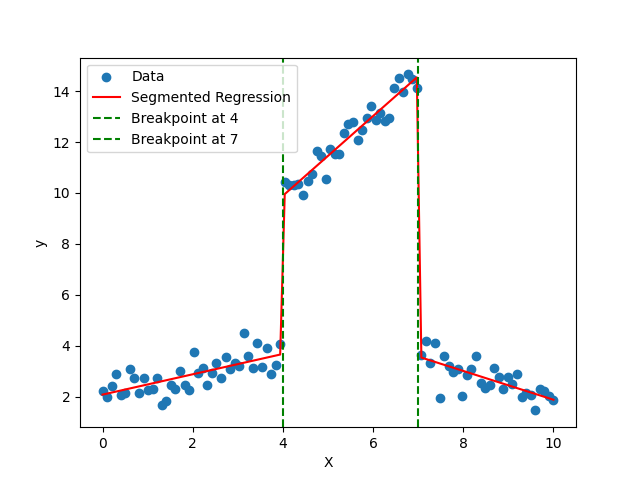

# Segmented Regression

## Overview
Segmented Regression is a Python implementation of a piecewise linear regression model for segmented regression analysis. It allows users to fit a segmented regression model to their data, where different linear relationships are defined for different segments of the independent variable.

This implementation provides flexibility by allowing users to specify breakpoints where the piecewise linear functions change. It uses optimization techniques to find the best fit for the segmented regression model.

## Usage
```
from segmented_regression import SegmentedRegressor
import numpy as np

# Generate synthetic data
np.random.seed(42)
X = np.linspace(0, 10, 100)
y = np.piecewise(X, [X < 4, (X >= 4) & (X < 7), X >= 7], [lambda x: 2 + 0.5*x, lambda x: 4 + 1.5*x, lambda x: 7 - 0.5*x])
y += np.random.normal(scale=0.5, size=y.shape)

# Define breakpoints
breakpoints = [4, 7]

# Fit segmented regression model
model = SegmentedRegressor(breakpoints)
model.fit(X, y)

# Predict and print summary
y_pred = model.predict(X)
model.summary()
```


## Example
The example provided above demonstrates how to use the Segmented Regression package to fit a segmented regression model to synthetic data with breakpoints at 4 and 7. It then predicts the output variable and prints a summary of the fitted model.

## Acknowledgments
- This implementation is inspired by the concept of segmented regression analysis.
- Thanks to the Python community for providing valuable libraries such as NumPy and SciPy.
